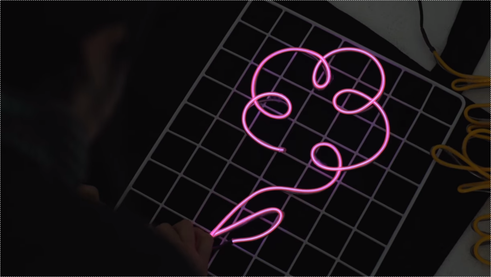
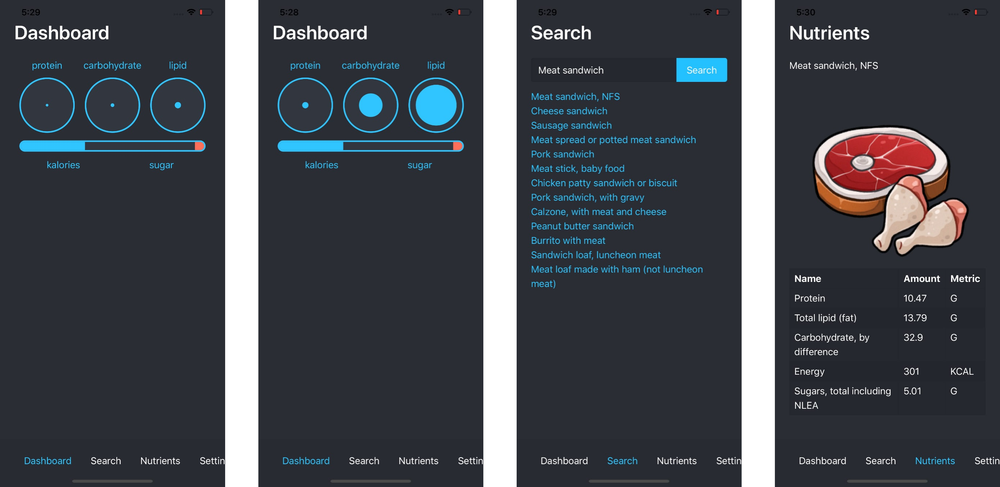

+++
author = "Kiselev Nikolay"
title = "Launch of machineand.me project"
date = "2019-05-20T10:23:54Z"
lastmod = "2020-10-28T18:08:56+03:00"
description = "Our way from first ideas to the launch of the «machine and me» foundation"
tags = ["About us"]
categories = []
series = []
image = "/moran-g8iL7HKv16k-unsplash.jpg"
+++

### First launch

On May 20, 2019 we registered the domain machineand.me. The mission of the company at that time was to make it easier for developers to work. We set goals for the optimization and automation of tasks and processes. We wanted to build our own DevOps stack. But the growth of our competences made us realize that our solutions were not flexible. That's when we started looking for new missions and making new plans.

We have closed some tools. Some were left in the plan only. But we have published a few tools:

- [Postblog](https://github.com/kiselev-nikolay/postblog)
- [Moduledocs](https://github.com/kiselev-nikolay/moduledocs)

### Second launch

We decided to experiment with creating real things, not software. This is just an interesting historical fact. We treated it as a hobby.
We made smart custom neon signs. Like on this image.

We even printed shirts with code. The project is still reachable but we stopped producing the [codetees](http://codetee.machineand.me/).

### Food recomendation software

In 2020 we set a new goal. Goal is to solve the problem of unbalanced nutrition. Each of us faces the daily problem of choosing food for breakfast, lunch or dinner. Some people eat lunch in a cafe and then count calories. Some of us make breakfast from what is left in the fridge. Some of us miss lunch because of work or study. Some miss dinners because of parties.

Idea was to make an application, which will help to choose the right balanced menu, prove that to eat fully is not only important, but also easy.

We had a [Presentation (Russian)](https://youtu.be/Ds15jafLvz8) to work together on the project with Mobile Dimension ltd. 